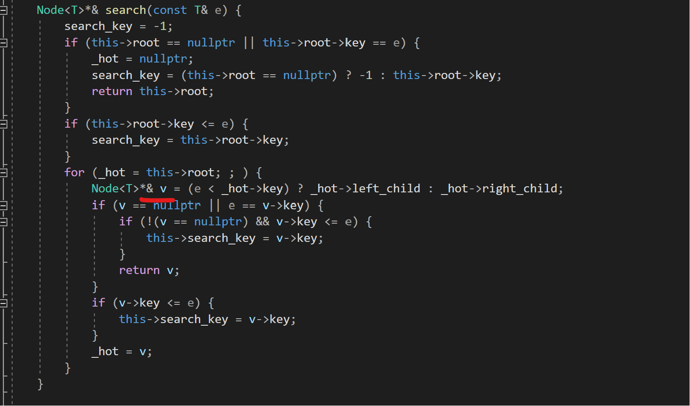
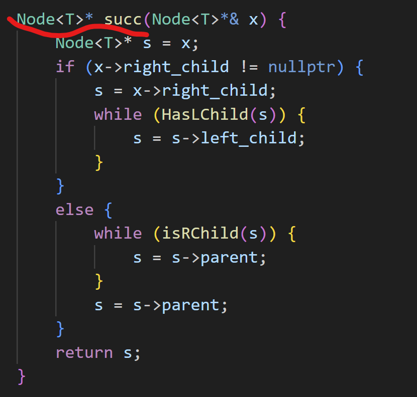

# LAB3 实现文档
* 该文档的目标是记录一些在编程当中出现的小问题。与其说是叫实现文档，不如说是叫 bug 文档。
## BST
* 在编写 BST 的时候遇到过许多 re 的 bug，大多因为引用不当导致。

* 如图为正确代码。其中，re的原因是在红线标记处的 `v` 没有使用引用类型变量。re 的触发是在 `insert` 接口当中（BST 的 `insert` 需要调用 `search` 接口）调用 `x = new Node<T>(e, this->_hot);`。
* 在这里 `v` 的含义是一路搜索到的目标节点（或外部空节点）的指针，在此基础上在 `insert` 接口当中进行调用 `new` 函数的时候会将新的节点直接插入到相应的树的位置————可以看出来，为了避免空指针导致的问题，在这个过程当中应该全部使用引用进行传参。否则，若这里不使用引用的话，`search` 返回的指针引用实际上可能是一个空指针（与树没有任何关系）。对这个指针进行 `new` 的话实际上只会产生一个与树没有任何连接关系的节点。
* 具体 OJ 的构造样例与运行环境不详，因此无法对于上述产生 re 的原因进行准确的分析。

* 在解决这个问题之后，`removeAt` 接口当中又出现了 re 的问题。经过了一番排查，发现是由于以下地方误传了引用:

* 如图为正确代码。